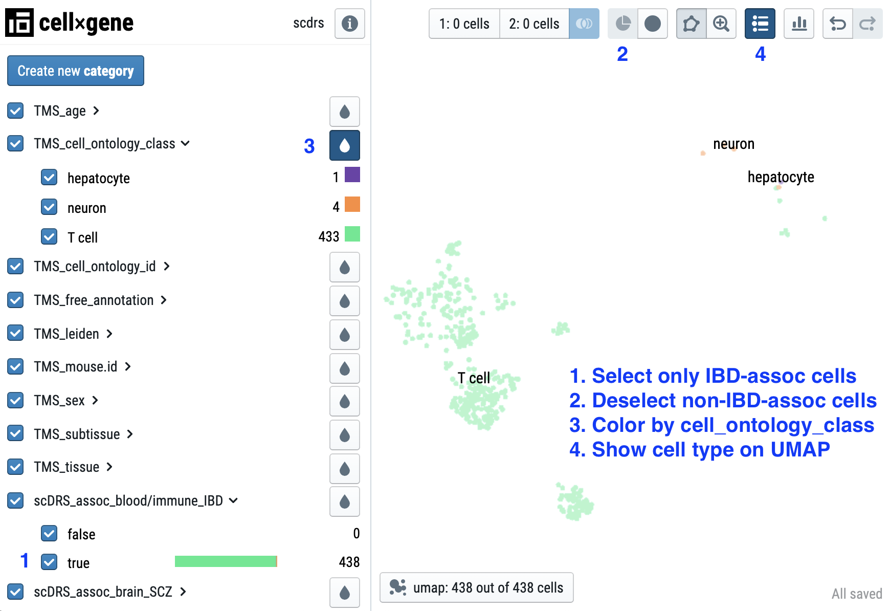

# scDRS

[scDRS](https://martinjzhang.github.io/scDRS/) (single-cell disease-relevance score) is a method for associating individual cells in scRNA-seq data with disease GWASs, built on top of [AnnData](https://anndata.readthedocs.io/en/latest/) and [Scanpy](https://scanpy.readthedocs.io/en/stable/). Check out the bioRxiv manuscript [Zhang*, Hou*, et al. "Polygenic enrichment distinguishes disease associations of individual cells in single-cell RNA-seq data"](XXX).

<!-- **Explore scDRS results**
- Results for [74 diseases/traits and the TMS FACS data](https://scdrs-tms-facs.herokuapp.com/)
- Demo for [3 diseases/traits and 3 TMS FACS cell types](https://scdrs-demo.herokuapp.com/) -->

**Code and data to reproduce results of the paper** 
- Details in [experiments folder](./experiments)
- [Gene set (.gs) files](https://figshare.com/articles/dataset/scDRS_data_release_092121/16664080?file=30853708) for 74 diseases and complex traits
- [scDRS results](https://figshare.com/articles/dataset/scDRS_data_release_092121_score_file_tmsfacs/16664077) for TMS FACS + 74 diseases/traits

## Explore scDRS results
- Demo for [3 TMS FACS cell types and 3 diseases/traits](https://scdrs-demo.herokuapp.com/)
- Results for [110,096 TMS FACS cells and 74 diseases/traits](https://scdrs-tms-facs.herokuapp.com/)

|   |  |
|:---:|:---:|
| 110,096 cells from 120 cell types in TMS FACS | IBD-associated cells |
  
  
<!--   Example: showing all cells associated with IBD
   -->


# Installation
Install from github:
```sh
git clone https://github.com/martinjzhang/scDRS.git
cd scDRS; pip install -e .
```

Quick test:
```sh
python -m pytest tests/test_scdrs.py -p no:warnings
```

Install from PyPI (coming soon)


# Usage/Demos
See [Documentation](https://martinjzhang.github.io/scDRS/reference.html).

```python
import os
import pandas as pd
from anndata import read_h5ad
import scdrs

# Load data
DATA_PATH = scdrs.__path__[0]
adata = read_h5ad(os.path.join(DATA_PATH, "data/toydata_mouse.h5ad"))
df_gs = pd.read_csv(os.path.join(DATA_PATH, "data/toydata_mouse.gs"), sep="\t")

# Compute scDRS gene-level and cell-level statistics
scdrs.method.compute_stats(adata)

# Compute scDRS results
gene_list = df_gs["GENESET"].values[0].split(",")
df_res = scdrs.method.score_cell(adata, gene_list)
print(df_res.iloc[:4])
```

The expected output is:
 |                 index                 | raw_score | norm_score | mc_pval  |   pval   | nlog10_pval |  zscore  |
 | :-----------------------------------: | :-------: | :--------: | :------: | :------: | :---------: | :------: |
 |      N1.MAA000586.3_8_M.1.1-1-1       | 5.495287  |  4.136498  | 0.001996 | 0.000067 |  4.176120   | 3.820235 |
 |       F10.D041911.3_8_M.1.1-1-1       | 5.507245  |  4.878401  | 0.001996 | 0.000067 |  4.176120   | 3.820235 |
 | A17_B002755_B007347_S17.mm10-plus-7-0 | 5.379276  |  3.338063  | 0.003992 | 0.000800 |  3.096939   | 3.155926 |
 |    C22_B003856_S298_L004.mus-2-0-1    | 5.443514  |  4.537418  | 0.001996 | 0.000067 |  4.176120   | 3.820235 |

where the columns are:
  1. index: cell names, should be the same as adata.obs_names
  2. raw_score: raw disease score
  3. norm_score: normalized disease score
  4. mc_pval: cell-level MC p-value
  5. pval: cell-level scDRS p-value
  6. nlog10_pval: -log10(pval)
  7. zscore: z-score converted from pval

----------------

## Computing scDRS results using bash scripts 
### Compute scDRS score files 
- Input: scRNA-seq .h5ad file and gene set .gs file
- Output: `{trait}.score.gz` and `{trait}.full_score.gz` for traits in the .gs file

```sh
h5ad_file=your_scrnaseq_data
cov_file=your_covariate_file
gs_file=your_gene_set_file
out_dir=your_output_folder

python compute_score.py \
    --h5ad_file ${h5ad_file}.h5ad\
    --h5ad_species mouse\
    --cov_file ${cov_file}.cov\
    --gs_file ${gs_file}.gs\
    --gs_species human\
    --flag_filter True\
    --flag_raw_count True\
    --n_ctrl 1000\
    --flag_return_ctrl_raw_score False\
    --flag_return_ctrl_norm_score True\
    --out_folder ${out_dir}
```

    --h5ad_file (.h5ad file) : scRNA-seq data
    --h5ad_species ("hsapiens"/"human"/"mmusculus"/"mouse") : species of the scRNA-seq data samples
    --cov_file (.cov file) : covariate file (optional, see below for file format)
    --gs_file (.gs file) : gene set file (see below for file format)
    --gs_species ("hsapiens"/"human"/"mmusculus"/"mouse") : species for genes in the gene set file 
    --flag_filter ("True"/"False") : if to perform minimum filtering of cells and genes
    --flag_raw_count ("True"/"False") : if to perform normalization (size-factor + log1p)
    --n_ctrl (int) : number of control gene sets (default 1,000)
    --flag_return_ctrl_raw_score ("True"/"False") : if to return raw control scores
    --flag_return_ctrl_norm_score ("True"/"False") : if to return normalized control scores
    --out_folder : output folder. Score files will be saved as `{out_folder}/{trait}.score.gz` (see below for file format)

### Compute scDRS downsteam analyses 
- Input: scRNA-seq .h5ad file, gene set .gs file, and scDRS .full_score.gz score files. 
- Output: `{trait}.scdrs_ct.{cell_type}` for cell type-level analyses (cell type-disease association and within-cell type association heterogeneity); `{trait}.scdrs_var` for cell variable-disease association analyses; `{trait}.scdrs_gene` for disease gene prioritization analyses.
```sh
python compute_downstream.py \
    --h5ad_file your_scrnaseq_data.h5ad \
    --score_file @.full_score.gz \
    --cell_type cell_type \
    --cell_variable causal_variable,non_causal_variable,covariate\
    --flag_gene True\
    --flag_filter False\
    --flag_raw_count False\
    --out_folder your_output_folder
```

    --h5ad_file (.h5ad file) : scRNA-seq data
    --score_file (.full_score.gz files) : scDRS full score files; supporting the use of "@" to match strings
    --cell_type (str) : cell type columns (supporting multiple columns separated by comma); must be present in adata.obs.columns; used for cell type-disease association analyses (5% quantile as test statistic) and detecting association heterogeneity within cell type (Geary's C as test statistic)
    --cell_variable (str) : cell-level variable columns (supporting multiple columns separated by comma); must be present in adata.obs.columns; used for cell variable-disease association analyses (Pearson's correlation as test statistic)
    --flag_gene ("True"/"False") : if to correlate scDRS disease scores with gene expression
    --flag_filter ("True"/"False") : if to perform minimum filtering of cells and genes
    --flag_raw_count ("True"/"False") : if to perform normalization (size-factor + log1p)
    --out_folder : output folder. Score files will be saved as `{out_folder}/{trait}.score.gz` (see below for file format)
    

## File formats
- .h5ad file (compatible with [scanpy](https://scanpy.readthedocs.io/en/stable/index.html))

- .gs file: .tsv file

    1. TRAIT: trait name
    2. GENESET: a comma-separated string of genes 

        Example:
    
        |           TRAIT           |         GENESET          |
        | :-----------------------: | :----------------------: |
        |        PASS_HbA1C         |   FN3KRP,FN3K,HK1,GCK    |
        | PASS_MedicationUse_Wu2019 | FTO,SEC16B,ADCY3,DNAJC27 |
            
- .cov file: .tsv file

    1. index: cell names, should be the same as adata.obs_names
    2. cov1: numerical-values covariate
    3. cov2: numerical-values covariate

        Example:
        |                 index                 | const | n_genes | sex_male |  age  |
        | :-----------------------------------: | :---: | :-----: | :------: | :---: |
        | A10_B000497_B009023_S10.mm10-plus-0-0 |   1   |  2706   |    1     |  18   |
        | A10_B000756_B007446_S10.mm10-plus-0-0 |   1   |  3212   |    1     |  18   |
  
- .score.gz file:
 
    1. index: cell names, should be the same as adata.obs_names
    2. raw_score: raw disease score
    3. norm_score: normalized disease score
    3. mc_pval: cell-level MC p-value
    3. pval: cell-level scDRS p-value
    3. nlog10_pval: -log10(pval)
    3. zscore: z-score converted from pval

        Example:
        |                 index                 | raw_score  | norm_score |  mc_pval   |     pval     | nlog10_pval |  zscore   |
        | :-----------------------------------: | :--------: | :--------: | :--------: | :----------: | :---------: | :-------: |
        | A10_B000497_B009023_S10.mm10-plus-0-0 | 0.7298449  | 7.0396357  | 0.04761905 | 0.0016638935 |  2.7788744  | 2.9357162 |
        | A10_B000756_B007446_S10.mm10-plus-0-0 | 0.72515404 |  7.300498  | 0.04761905 | 0.0016638935 |  2.7788744  | 2.9357162 |
