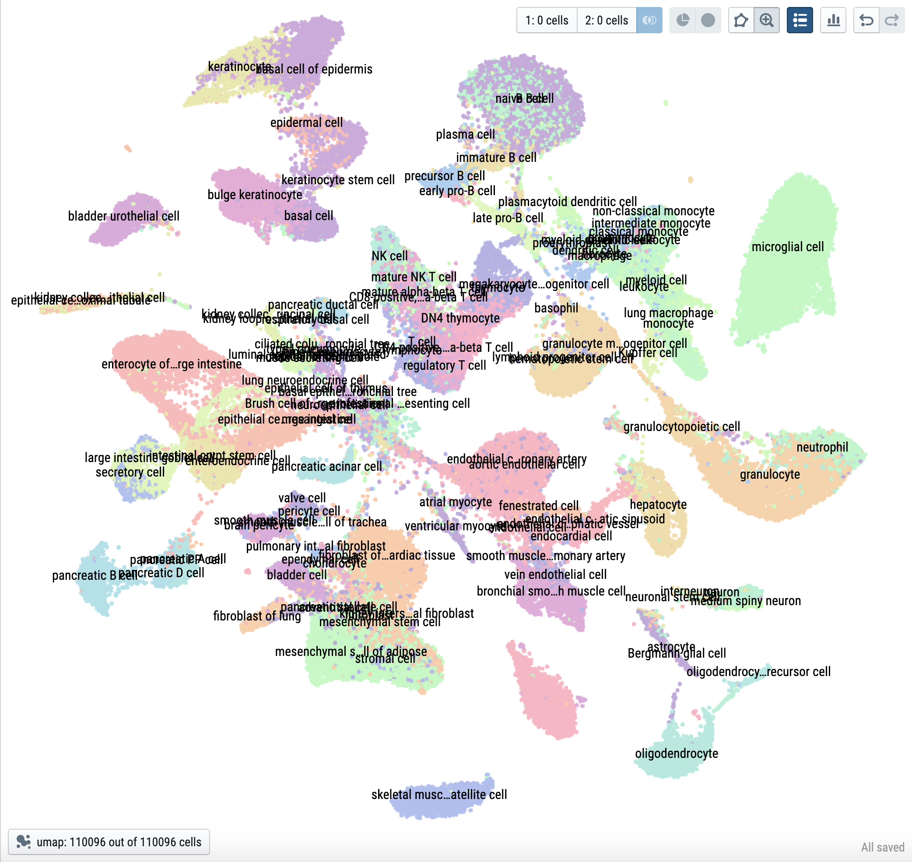
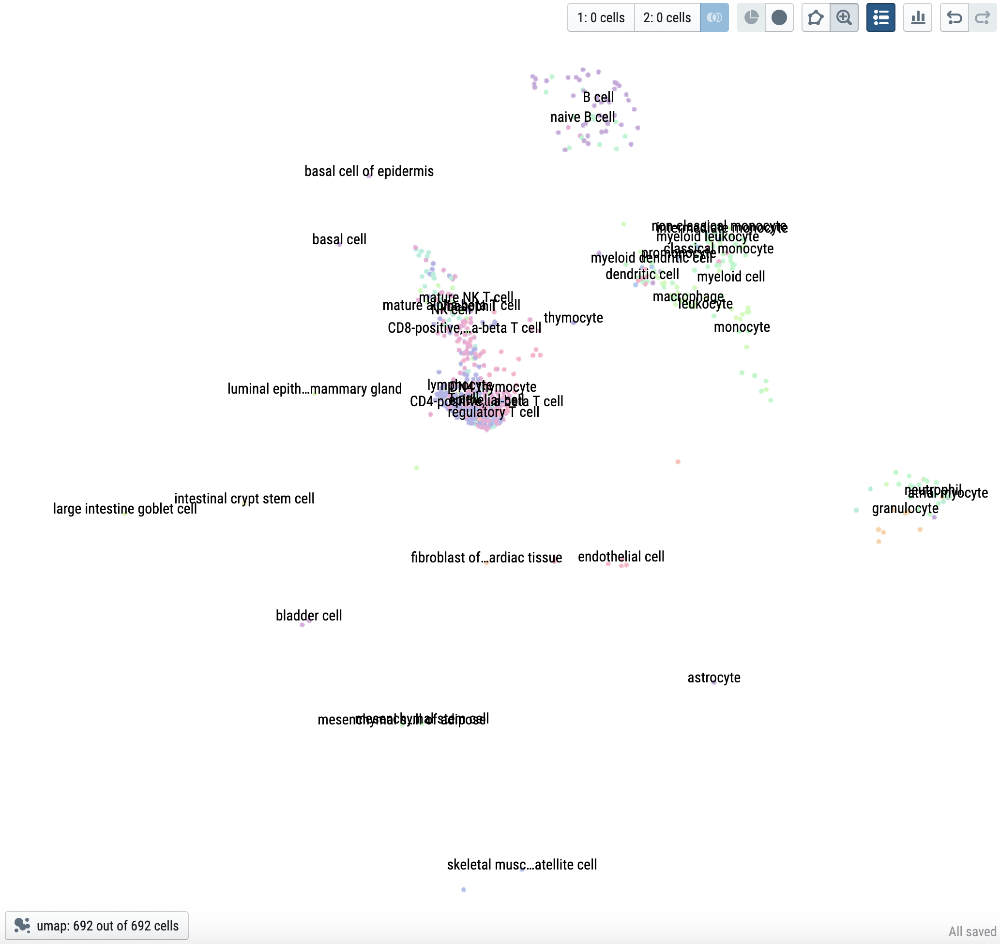

<!--# scDRS <!-- omit in toc -->

scDRS (single-cell disease-relevance score) is a method for associating individual cells in single-cell RNA-seq data with disease GWASs, built on top of [AnnData](https://anndata.readthedocs.io/en/latest/) and [Scanpy](https://scanpy.readthedocs.io/en/stable/). 

Check out our manuscript [Zhang*, Hou*, et al. “Polygenic enrichment distinguishes disease associations of individual cells in single-cell RNA-seq data"](https://www.biorxiv.org/content/10.1101/2021.09.24.461597v2).

Read the [documentation](https://martinjzhang.github.io/scDRS/): [installation](https://martinjzhang.github.io/scDRS/index.html#installation), [usage](https://martinjzhang.github.io/scDRS/index.html#usage), [command-line interface (CLI)](https://martinjzhang.github.io/scDRS/reference_cli.html#), [file formats](https://martinjzhang.github.io/scDRS/file_format.html), etc. 

### Software version
- v1.0.0: current version. 
- [beta](https://github.com/martinjzhang/scDRS/tree/v0.1): version for the initial submission.


### Code and data to reproduce results of the paper
See [scDRS_paper](https://github.com/martinjzhang/scDRS_paper) for more details ([experiments](./experiments) folder is deprecated). Data are at [figshare](https://figshare.com/projects/Single-cell_Disease_Relevance_Score_scDRS_/118902). 
- Download [GWAS gene sets](https://figshare.com/articles/dataset/scDRS_data_release_030122/19312583?file=34300898) (**.gs** files) for 74 diseases and complex traits.
- Download [scDRS results](https://figshare.com/articles/dataset/scDRS_data_release_030122_score_file_tmsfacs/19312607) (**.score.gz** and **.full_score.gz** files) for TMS FACS + 74 diseases/trait.

Older versions
- Initial submission: [GWAS gene sets](https://figshare.com/articles/dataset/scDRS_data_release_092121/16664080?file=30853708) and [scDRS results](https://figshare.com/articles/dataset/scDRS_data_release_092121_score_file_tmsfacs/16664077).


### Explore scDRS results via [cellxgene](https://chanzuckerberg.github.io/cellxgene/)
- Demo for [3 TMS FACS cell types and 3 diseases/traits](https://scdrs-demo.herokuapp.com/).
- Results for [110,096 TMS FACS cells and 74 diseases/traits](https://scdrs-tms-facs.herokuapp.com/).
- Download [h5ad files](https://figshare.com/articles/dataset/scdrs_cellxgene/15065061) for cellxgene.

|  |  |
| :--------------------------------------------------------------------------------: | :------------------------------------------------------------------------------------: |
|                   110,096 cells from 120 cell types in TMS FACS                    |                                  IBD-associated cells                                  |


<!--# Table of contents <!-- omit in toc -->
<!-- - [Installation](#installation)
- [Within python scDRS demo](#within-python-scdrs-demo)
- [Command line interface for scDRS score calculation](#command-line-interface-for-scdrs-score-calculation)
- [Command line interface for scDRS downsteam applications](#command-line-interface-for-scdrs-downsteam-applications)
- [File formats](#file-formats)
  - [scDRS input files](#scdrs-input-files)
  - [scDRS output files](#scdrs-output-files)
 -->
 
<!---
# Installation
Install from github:
```sh
git clone https://github.com/martinjzhang/scDRS.git
cd scDRS; pip install -e .
# Current version under development; switch to submission version
# https://github.com/martinjzhang/scDRS/releases/tag/v0.1
git checkout -b initial_submission v0.1 
```

Quick test:
```sh
python -m pytest tests/test_scdrs.py -p no:warnings
```

Install from PyPI (coming soon)
-->


<!---
# Within python scDRS demo 

We attach a toy example as follows, see [Documentation](https://martinjzhang.github.io/scDRS/reference.html) for detailed information.

```python
import os
import pandas as pd
from anndata import read_h5ad
import scdrs

# Load data
DATA_PATH = scdrs.__path__[0]
adata = read_h5ad(os.path.join(DATA_PATH, "data/toydata_mouse.h5ad"))
df_gs = pd.read_csv(os.path.join(DATA_PATH, "data/toydata_mouse.gs"), sep="\t")

# Compute scDRS gene-level and cell-level statistics
scdrs.method.compute_stats(adata)

# Compute scDRS results
gene_list = df_gs["GENESET"].values[0].split(",")
df_res = scdrs.method.score_cell(adata, gene_list)
print(df_res.iloc[:4])
```

The expected output is (see below for format of **.score.gz** file):
  |                 index                 | raw_score | norm_score | mc_pval  |   pval   | nlog10_pval |  zscore  |
  | :-----------------------------------: | :-------: | :--------: | :------: | :------: | :---------: | :------: |
  |      N1.MAA000586.3_8_M.1.1-1-1       | 5.495287  |  4.136498  | 0.001996 | 0.000067 |  4.176120   | 3.820235 |
  |       F10.D041911.3_8_M.1.1-1-1       | 5.507245  |  4.878401  | 0.001996 | 0.000067 |  4.176120   | 3.820235 |
  | A17_B002755_B007347_S17.mm10-plus-7-0 | 5.379276  |  3.338063  | 0.003992 | 0.000800 |  3.096939   | 3.155926 |
  |    C22_B003856_S298_L004.mus-2-0-1    | 5.443514  |  4.537418  | 0.001996 | 0.000067 |  4.176120   | 3.820235 |
-->


## scDRS scripts (deprecated) 
---
**NOTE:** scDRS scripts are still maintained but deprecated. Consider using [scDRS command-line interface](https://martinjzhang.github.io/scDRS/reference_cli.html) instead.

---

### scDRS script for score calculation 
Input: scRNA-seq data (**.h5ad** file) and gene set file (**.gs** file)

Output: scDRS score file (**{trait}.score.gz** file) and full score file (**{trait}.full_score.gz** file) for each trait in the **.gs** file

```sh
h5ad_file=your_scrnaseq_data
cov_file=your_covariate_file
gs_file=your_gene_set_file
out_dir=your_output_folder

python compute_score.py \
    --h5ad_file ${h5ad_file}.h5ad\
    --h5ad_species mouse\
    --cov_file ${cov_file}.cov\
    --gs_file ${gs_file}.gs\
    --gs_species human\
    --flag_filter True\
    --flag_raw_count True\
    --n_ctrl 1000\
    --flag_return_ctrl_raw_score False\
    --flag_return_ctrl_norm_score True\
    --out_folder ${out_dir}
```

- `--h5ad_file` (**.h5ad** file) : scRNA-seq data
- `--h5ad_species` ("hsapiens"/"human"/"mmusculus"/"mouse") : species of the scRNA-seq data samples
- `--cov_file` (**.cov** file) : covariate file (optional, .tsv file, see [file format](https://martinjzhang.github.io/scDRS/file_format.html))
- `--gs_file` (**.gs** file) : gene set file (see [file format](https://martinjzhang.github.io/scDRS/file_format.html))
- `--gs_species` ("hsapiens"/"human"/"mmusculus"/"mouse") : species for genes in the gene set file 
- `--flag_filter` ("True"/"False") : if to perform minimum filtering of cells and genes
- `--flag_raw_count` ("True"/"False") : if to perform normalization (size-factor + log1p)
- `--n_ctrl` (int) : number of control gene sets (default 1,000)
- `--flag_return_ctrl_raw_score` ("True"/"False") : if to return raw control scores
- `--flag_return_ctrl_norm_score` ("True"/"False") : if to return normalized control scores
- `--out_folder` : output folder. Score files will be saved as `{out_folder}/{trait}.score.gz` (see [file format](https://martinjzhang.github.io/scDRS/file_format.html))

### scDRS script for downsteam applications

Input: scRNA-seq data (**.h5ad** file), gene set file (**.gs** file), and scDRS full score files (**.full_score.gz** files)

Output: **{trait}.scdrs_ct.{cell_type}** file (same as the new **{trait}.scdrs_group.{cell_type}** file) for cell type-level analyses (association and heterogeneity); **{trait}.scdrs_var** file (same as the new **{trait}.scdrs_cell_corr** file) for cell variable-disease association; **{trait}.scdrs_gene** file for disease gene prioritization.

```sh
h5ad_file=your_scrnaseq_data
out_dir=your_output_folder
python compute_downstream.py \
    --h5ad_file ${h5ad_file}.h5ad \
    --score_file @.full_score.gz \
    --cell_type cell_type \
    --cell_variable causal_variable,non_causal_variable,covariate\
    --flag_gene True\
    --flag_filter False\
    --flag_raw_count False\ # flag_raw_count is set to `False` because the toy data is already log-normalized, set to `True` if your data is not log-normalized
    --out_folder ${out_dir}
```

- `--h5ad_file` (**.h5ad** file) : scRNA-seq data
- `--score_file` (**.full_score.gz** files) : scDRS full score files; supporting use of "@" to match strings
- `--cell_type` (str) : cell type column (supporting multiple columns separated by comma); must be present in `adata.obs.columns`; used for cell type-disease association analyses (5% quantile as test statistic) and detecting association heterogeneity within cell type (Geary's C as test statistic)
- `--cell_variable` (str) : cell-level variable columns (supporting multiple columns separated by comma); must be present in `adata.obs.columns`; used for cell variable-disease association analyses (Pearson's correlation as test statistic)
- `--flag_gene` ("True"/"False") : if to correlate scDRS disease scores with gene expression
- `--flag_filter` ("True"/"False") : if to perform minimum filtering of cells and genes
- `--flag_raw_count` ("True"/"False") : if to perform normalization (size-factor + log1p)
- `--out_folder` : output folder. Score files will be saved as `{out_folder}/{trait}.scdrs_ct.{cell_type}` for cell type-level analyses (association and heterogeneity); `{out_folder}/{trait}.scdrs_var` file for cell variable-disease association; `{out_folder}/{trait}.scdrs_var.{trait}.scdrs_gene` file for disease gene prioritization. (see [file format](https://martinjzhang.github.io/scDRS/file_format.html))
    

<!---
# File formats
## scDRS input files
**.h5ad** file (scRNA-seq data, compatible with [scanpy](https://scanpy.readthedocs.io/en/stable/index.html))
            
**.cov** file (.tsv file) : covariate file for the scRNA-seq data
- index: cell names, consistent with `adata.obs_names`
- other comlumns: covariate with numerical values

  |          index          | const | n_genes | sex_male |  age  |
  | :---------------------: | :---: | :-----: | :------: | :---: |
  | A10_B000497_B009023_S10 |   1   |  2706   |    1     |  18   |
  | A10_B000756_B007446_S10 |   1   |  3212   |    1     |  18   |
        
**.gs** file (.tsv file) : one can use [precomputed GWAS gene sets](https://figshare.com/articles/dataset/scDRS_data_release_092121/16664080?file=30853708) for 74 diseases and complex traits or [compute gene sets directly from GWAS](docs/compute_magma_gs.md).
- TRAIT: trait name
- GENESET: a comma-separated string of genes 

  |           TRAIT           |         GENESET          |
  | :-----------------------: | :----------------------: |
  |        PASS_HbA1C         |   FN3KRP,FN3K,HK1,GCK    |
  | PASS_MedicationUse_Wu2019 | FTO,SEC16B,ADCY3,DNAJC27 |

## scDRS output files
**{trait}.score.gz** file : scDRS score file
- index: cell names, should be the same as adata.obs_names
- raw_score: raw disease score
- norm_score: normalized disease score
- mc_pval: cell-level MC p-value
- pval: cell-level scDRS p-value
- nlog10_pval: -log10(pval)
- zscore: z-score converted from pval

  |          index          | raw_score | norm_score | mc_pval |  pval   | nlog10_pval | zscore |
  | :---------------------: | :-------: | :--------: | :-----: | :-----: | :---------: | :----: |
  | A10_B000497_B009023_S10 |   0.730   |    7.04    | 0.0476  | 0.00166 |    2.78     |  2.94  |
  | A10_B000756_B007446_S10 |   0.725   |    7.30    | 0.0476  | 0.00166 |    2.78     |  2.94  |
        
**{trait}.full_score.gz** file : scDRS full score file
- All contents of **{trait}.score.gz** file
- ctrl_norm_score_{i_ctrl} : raw control scores (specified by `--flag_return_ctrl_raw_score True`) 
- ctrl_norm_score_{i_ctrl} : normalized control scores (specified by `--flag_return_ctrl_norm_score True`) .

**{trait}.scdrs_ct.{cell_type}** file : cell type-level analysis (association and heterogeneity)
- {trait} : trait name consistent with **{trait}.full_score.gz** file
- {cell_type} : the cell type column in `adata.obs.columns`
- first column: cell types in the `adata.obs` `cell_type` column
- n_cell: number of cells from the cell type
- n_ctrl: number of control gene sets
- assoc_mcp: MC p-value for cell type-disease association
- assoc_mcz: MC z-score for cell type-disease association
- hetero_mcp:  MC p-value for within-cell type heterogeneity in association with disease
- hetero_mcz:  MC z-score for within-cell type heterogeneity in association with disease

  |                 | n_cell | n_ctrl | assoc_mcp  | assoc_mcz  | hetero_mcp | hetero_mcz |
  | :-------------: | :----: | :----: | :--------: | :--------: | :--------: | :--------: |
  |   causal_cell   |  10.0  |  20.0  | 0.04761905 | 12.297529  |    1.0     |    1.0     |
  | non_causal_cell |  20.0  |  20.0  | 0.9047619  | -1.1364214 |    1.0     |    1.0     |

**{trait}.scdrs_var** file : cell-level variable analysis (association to disease)
- {trait} : trait name consistent with **{trait}.full_score.gz** file
- first column: all cell-level variables (specified in `--cell_variable`)
- n_ctrl: number of control gene sets
- corr_mcp: MC p-value for cell-level variable association with disease
- corr_mcz: MC z-score for cell-level variable association with disease

  |                     | n_ctrl |  corr_mcp  | corr_mcz  |
  | :-----------------: | :----: | :--------: | :-------: |
  |   causal_variable   |  20.0  | 0.04761905 | 3.4574268 |
  | non_causal_variable |  20.0  | 0.23809524 | 0.8974108 |
  |      covariate      |  20.0  | 0.1904762  | 1.1220891 |

**{trait}.scdrs_gene** file : correlation of gene expression with scDRS disease score
- {trait} : trait name consistent with **{trait}.full_score.gz** file
- first column: genes in `adata.var_names`
- CORR: correlation with scDRS disease score across all cells in adata
- RANK: correlation of correlation across genes

  |  index   | CORR  | RANK  |
  | :------: | :---: | :---: |
  | Serping1 | 0.314 |   0   |
  |   Lmna   | 0.278 |   1   |

-->
